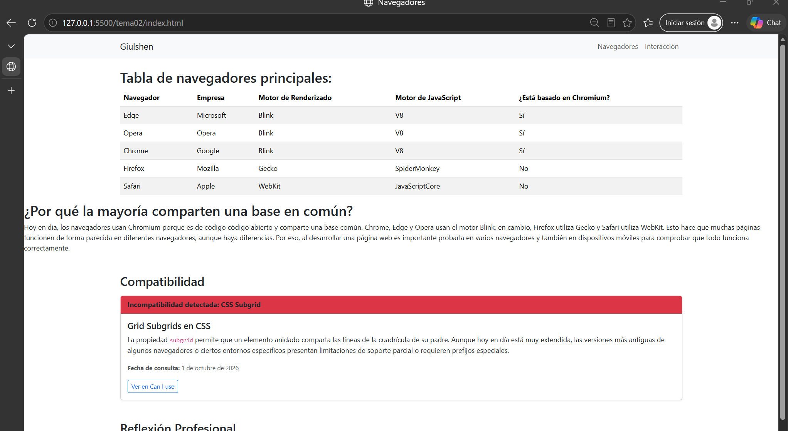
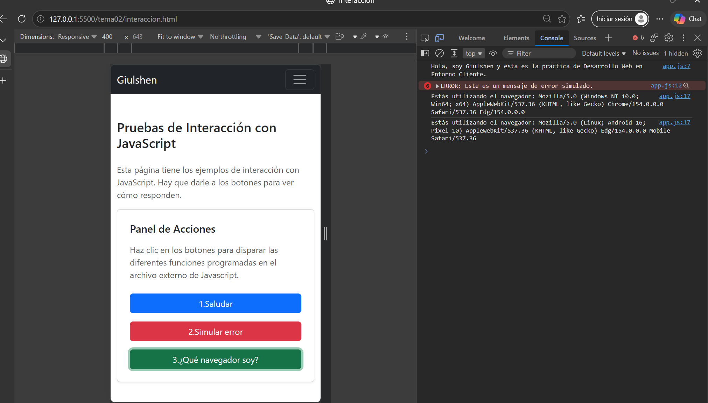
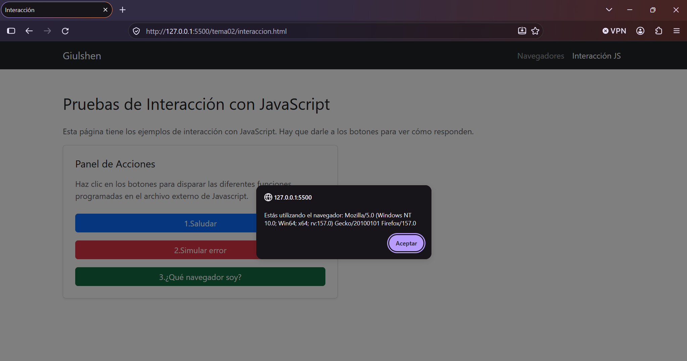
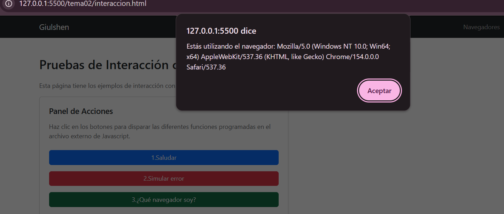

Tarea 2 - Navegadores, motores y primera página interactiva

¿De qué trata la práctica?

En esta práctica he trabajado con diferentes navegadores web y sus motores de renderizado y de JavaScript.

También he creado una página con JavaScript donde hay varios botones que realizan diferentes acciones.

Archivos del proyecto

index.html:Es la página principal. Aquí está la tabla con los diferentes navegadores, sus empresas y los motores que utilizan.
interaccion.html:Es la página donde están los botones para probar las funciones de JavaScript.
js/app.js:Es el archivo donde he escrito las funciones de JavaScript.
README.md:Es este archivo, donde explico de qué trata la práctica.

Navegadores

En la tabla he puesto los 5 navegadores:

Chrome
Edge
Opera
Firefox
Safari

En ella se puede ver qué empresa pertenece a cada navegador, qué motor de renderizado utiliza, qué motor de JavaScript tiene y si está basado en Chromium.

JavaScript

En la página de interacción he creado tres botones:

Saludar: Aparece un mensaje con mi nombre.
Simular error: Nos muestra un mensaje de error en la consola.
¿Qué navegador soy?:Nos muestra la información sobre el navegador que estoy utilizando.

También he usado `console.log()` y `console.error()` para mostrar información en la consola del navegador.

Tecnologías utilizadas

Para hacer esta práctica he utilizado:

HTML
JavaScript
Bootstrap
Bootstrap Icons

Compatibilidad

He tenido en cuenta que una página web puede verse en diferentes navegadores y dispositivos. 
Por eso es importante probarla en varios navegadores para comprobar que funciona correctamente.

Autor:

Giulshen Hueso Cruz

Capturas de pantalla

1. Página principal en ordenador

2. Página de interacción en modo móvil

3. Consola con los tres botones

4. UserAgent en Chrome

5. UserAgent en Firefox

