
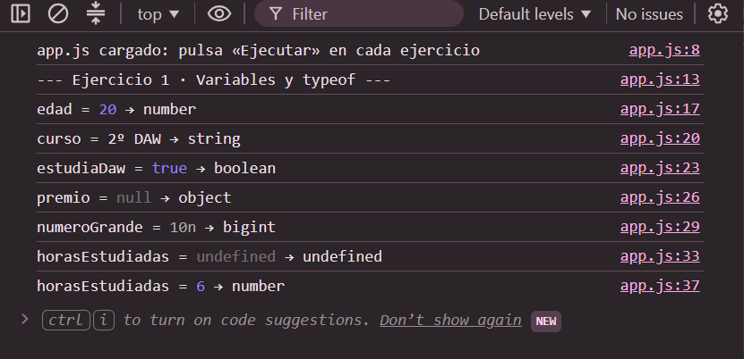
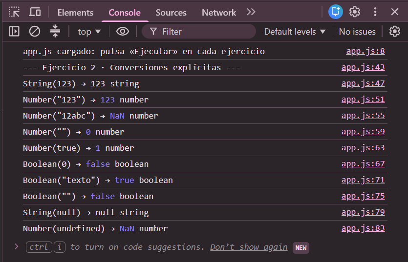
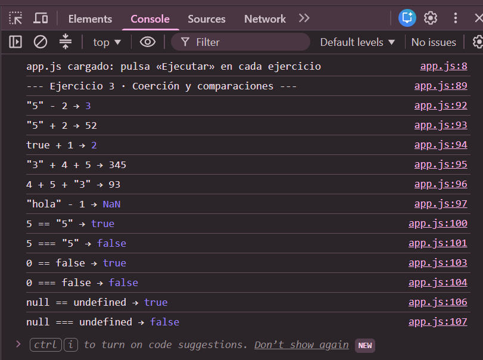
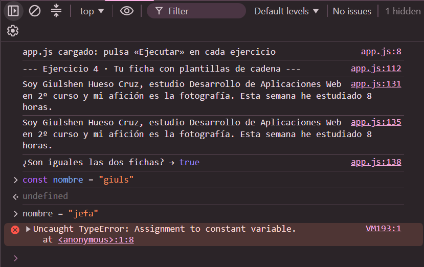

# Tarea 3 · Variables, tipos y conversiones

**Autor:** Giulshen Hueso Cruz · Desarrollo Web en Entorno Cliente (DWEC) · 2.º DAW · Curso 2026-27

Esta carpeta contiene una página con cuatro ejercicios de JavaScript sobre variables, tipos y conversiones, maquetada con Bootstrap. Para verla, abro la carpeta en VS Code, pulso **Go Live**, abro la consola con F12 y pulso "Ejecutar" en cada ejercicio. Cada card enseña el código, una tabla con lo que esperaba y lo que salió de verdad, y los resultados aparecen en la consola.

## Capturas

### a) La página entera

Se ve mi nombre en la navbar, las cuatro cards con su código, sus tablas «Espero / Sale» y su botón, y mi nombre otra vez en el pie.

### b) Consola del ejercicio 1

Se ven las seis variables con su valor y su typeof, y la variable `horasEstudiadas` primero como `undefined` y después como `number`.

### c) Consola del ejercicio 2

Se ven las diez conversiones con su resultado y su tipo, incluidos los dos `NaN` de `Number("12abc")` y `Number(undefined)`.

### d) Consola del ejercicio 3

Se ven las seis expresiones que mezclan tipos y las tres parejas comparadas con `==` y con `===`.

### e) Consola del ejercicio 4, con el error de la const

Se ve la ficha hecha con plantilla de cadena y con `+`, la comparación con `===` que da `true`, y el error `Assignment to constant variable` al cambiar una const.

## Reflexión

Lo más intuitivo fueron las conversiones a boolean: `Boolean(0)` y `Boolean("")` dan `false`, y `Boolean("texto")` da `true`, porque «vacío» y «cero» se entienden como «no hay nada». También se entiende bien `Number("123")`, que da 123. Lo que más me sorprendió fue `typeof null`, que devuelve `"object"` aunque null no es un objeto, y `Number("")`, que da 0 y no `NaN`. Otra sorpresa fue `"3" + 4 + 5`, que da `"345"`, frente a `4 + 5 + "3"`, que da `"93"`: el orden decide cuándo empieza a mandar la cadena. Con `-`, `*` y `/` manda el número, y `"hola" - 1` da `NaN`. Por eso comparo siempre con `===`: `0 == false` da `true`, pero `0 === false` da `false`.

## Fuentes

- [typeof · MDN](https://developer.mozilla.org/es/docs/Web/JavaScript/Reference/Operators/typeof)
- [Number · MDN](https://developer.mozilla.org/es/docs/Web/JavaScript/Reference/Global_Objects/Number)
- [Boolean · MDN](https://developer.mozilla.org/es/docs/Web/JavaScript/Reference/Global_Objects/Boolean)
- [Igualdad y comparaciones · MDN](https://developer.mozilla.org/es/docs/Web/JavaScript/Equality_comparisons_and_sameness)
- [Plantillas de cadena · MDN](https://developer.mozilla.org/es/docs/Web/JavaScript/Reference/Template_literals)
- [const · MDN](https://developer.mozilla.org/es/docs/Web/JavaScript/Reference/Statements/const)

## Uso de IA

He usado Chatgp para ivestigar de cosas de  JS y Claude para preparar un primer borrador del código de `app.js`, de las tablas y de este README a partir de la plantilla del profesor. Después ejecuté cada ejercicio, comprobé en la consola que los resultados coincidían con las tablas, y he estudiado cada línea para poder explicarla en la defensa.
